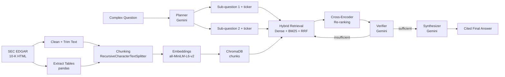

# 🧠 Multi-Step Financial Research Agent

An agentic RAG system that answers complex, multi-part financial research questions by decomposing them into sub-questions, retrieving evidence independently for each, verifying that the evidence is actually sufficient, and synthesizing a final cited answer — built on real SEC 10-K filings from public SaaS companies (Salesforce, ServiceNow, Workday, Adobe).

## Overview

Standard RAG does a single retrieval pass: embed the question, search once, stuff the top-k chunks into a prompt, generate an answer. This works for simple factual lookups, but breaks down on questions that require reasoning across multiple documents — e.g. *"How did Salesforce's and Workday's AI strategies differ?"* A single blended search over a multi-company question retrieves an uneven mix of evidence, with no way to know whether what was retrieved was actually sufficient before generating an answer.

This project adds **planning** (decompose the question into sub-questions), **independent retrieval per sub-question**, and **self-verification with retry** before ever generating a final answer — turning a static retrieval pipeline into an agentic one that checks its own work.

## Architecture



## Key Features

- **Agentic decomposition** — a planner splits multi-company questions into standalone sub-questions, each tagged with the correct company ticker
- **Hybrid retrieval** — dense vector search (cosine similarity) and BM25 keyword search run in parallel, merged via Reciprocal Rank Fusion, then re-ranked with a cross-encoder for higher precision
- **Self-verification with retry** — a separate LLM call judges whether retrieved evidence is actually sufficient; if not, it reformulates the query and retries (capped at 2 attempts) before falling back
- **Structured + unstructured retrieval** — financial tables (equity investments, carrying values) are extracted from HTML and embedded alongside narrative text, so numeric questions can retrieve real figures, not just prose
- **Cited synthesis** — the final answer merges all verified sub-answers into one coherent response, with claims attributed back to the source company
- **Full reasoning trace UI** — the React frontend shows the plan, each sub-question's retrieval/verification status, and the final answer — not just a black-box response
- **REST API** — FastAPI backend with a `/query` endpoint, auto-generated interactive docs at `/docs`
- **Evaluated** — faithfulness and answer relevancy scored via a custom LLM-as-judge evaluator

## Evaluation Results

*(partial run — 3 of 5 test questions scored before hitting free-tier API rate limits; see [Limitations](#limitations--future-work))*

| Question | Faithfulness | Relevancy |
|---|---|---|
| What is Salesforce's AI strategy? | 1.00 | 1.00 |
| What is Workday's AI strategy? | 1.00 | 1.00 |
| What is ServiceNow's core business focus? | 0.90 | 1.00 |
| **Average** | **0.97** | **1.00** |

Scoring method: custom LLM-as-judge (Gemini) — faithfulness measures whether every claim in the answer is grounded in retrieved evidence; relevancy measures whether the answer directly addresses the question asked. Full methodology in [Architecture Decisions](#architecture-decisions).

## Tech Stack

Python 3.11 · FastAPI · React (Vite) + Tailwind CSS · ChromaDB · sentence-transformers (`all-MiniLM-L6-v2`) · cross-encoder (`ms-marco-MiniLM-L-6-v2`) · rank_bm25 · Google Gemini 2.5 Flash · pandas

## Setup / Installation

**1. Clone and create a virtual environment** (Python 3.11 or 3.12 recommended — newer versions may lack pre-built wheels for some dependencies):
```bash
git clone https://github.com/your-username/research-agent.git
cd research-agent
python -m venv venv
venv\Scripts\activate        # Windows
pip install -r requirements.txt
```

**2. Set up environment variables** — create a `.env` file in the project root:
```
GEMINI_API_KEY=your_key_here
```

**3. Run the ingestion pipeline** (one-time, builds the vector store):
```bash
python -m ingestion.fetch_data
python -m ingestion.clean_text
python -m ingestion.chunker
python -m ingestion.extract_tables
python -m ingestion.embed_and_store
python -m ingestion.add_tables_to_vectorstore
```

**4. Run the backend:**
```bash
uvicorn api.app:app --reload --port 8000
# API docs: http://127.0.0.1:8000/docs
```

**5. Run the frontend** (separate terminal):
```bash
cd frontend
npm install
npm run dev
```

## Usage

**Via the web UI** — open the frontend, type a question (e.g. *"How did Salesforce's and Workday's AI strategies differ?"*), and view the full reasoning trace alongside the final answer.

**Via the API directly:**
```bash
curl -X POST http://127.0.0.1:8000/query \
  -H "Content-Type: application/json" \
  -d '{"question": "What is Salesforce'\''s AI strategy?"}'
```

Response includes the full trace (sub-questions, retrieval, verification status per sub-question) and the final synthesized answer with citations.

**Run evaluation:**
```bash
python -m eval.run_eval
```

## Architecture Decisions

- **Hybrid search over pure dense retrieval** — dense embeddings alone miss exact terms (product names, specific figures); BM25 catches those, merged via Reciprocal Rank Fusion rather than direct score comparison, since cosine similarity and BM25 scores aren't on comparable scales.
- **Verification with a bounded retry loop** — rather than trusting whatever retrieval returns, a separate LLM call judges sufficiency and can trigger one reformulated retry (capped at 2), balancing hallucination risk against cost/latency.
- **Custom evaluator instead of RAGAS** — RAGAS's dependency chain conflicted with the project's Python environment (a `langchain_community` internal import broke against the installed `ragas` version). Rather than continuing to chase version pins, a lightweight LLM-as-judge evaluator was implemented directly, scoring the same faithfulness/relevancy dimensions RAGAS targets.
- **Table extraction with numeric-density filtering** — SEC HTML includes many purely cosmetic tables (signatures, exhibit indexes). Tables are filtered by cell count and proportion of numeric content, rather than accepting every `<table>` tag pandas finds.
- **Custom orchestration over a LangChain agent framework** — the plan → retrieve → verify → synthesize loop is implemented directly in Python rather than through a pre-built agent framework, for full control over retry logic and easier debugging.

## Limitations / Future Work

- Scoped to four companies; asking about others currently risks the planner guessing a ticker with no matching data — explicit out-of-scope detection is designed but not yet merged
- Free-tier Gemini API limits (as low as 20 requests/day on some models) constrain how much evaluation can be run in a single session; the evaluation set was reduced from 10 to 5 questions and one run still hit the daily cap
- Table extraction handles standard SEC HTML well, but deeply nested/malformed tables (e.g. certain exhibit indexes) are filtered out rather than parsed
- No multi-turn conversation support — each question is handled independently, with no memory of prior questions in the same session
- Planned but not yet built: earnings call transcripts as a second data source, GraphRAG-style entity/relationship retrieval, and tool-use for numeric calculations beyond what's stated directly in the filings

## License

MIT